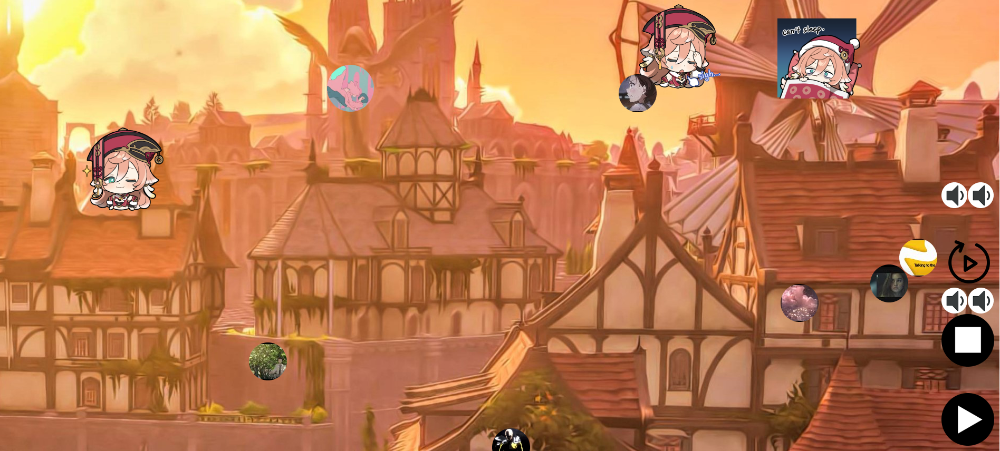

# Interactive Music Player

A music player that plays music based the icon's you click.

## Additional Features
Playlist button, shuffle button

## Setup
Simply download the file and run Run.py (assuming you have pygame installed)

## Warnings
The folder contains large files
Code is made during my second year(first semester in CS after transfer) and is slightly messy.
